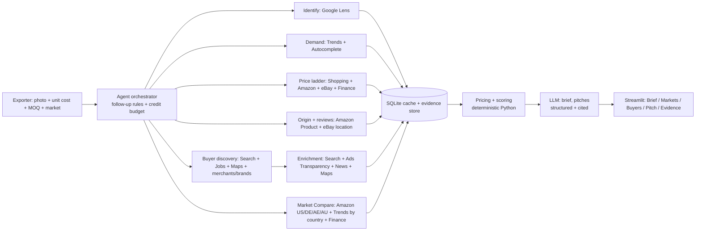

# ExportScout

**One product photo → UK buyers, a quote range and a pitch.**


**▶ Live demo:** https://exportscout-india.streamlit.app (Demo Mode, no keys needed)  
**🎬 Demo video:** https://youtu.be/bKHpvZXYfY0

ExportScout helps a small Moradabad brassware exporter sell into the UK now that Indian handicrafts enter duty-free. The owner uploads one product photo, a unit cost in ₹ and an MOQ. An agent then searches the UK market through [SerpApi](https://serpapi.com) and returns:

- a **FOB quote range** with a **Go / Tight / No-go** margin verdict
- a **Market Opportunity Score**
- the **top customer complaints**, turned into spec fixes
- a **ranked list of UK buyers**, including companies hiring a buyer right now, where every point links to the search result behind it
- a **pitch email** for each buyer
- a **Market Compare** of the same product in the US, Germany, the UAE and Australia, after each market's duty: where to sell next

SerpApi India Hackathon 2026 · Track 04: Commerce & Market Intelligence.

**Documentation:**
- [Architecture & process design](docs/ARCHITECTURE.md)
- [Run & deploy](docs/DEPLOYMENT.md)
- Example outputs: [lantern](docs/examples/lantern_brief.md) · [planter](docs/examples/planter_brief.md)
- [Day-1 data check](docs/day1_report.md)

<!-- screenshot: Brief tab (verdict badge, quote range, Market Opportunity Score, price chart) -->

---

## The problem

- **One cluster, one customer country.** Moradabad exports **₹8,500–9,000 crore a year, and about 75% of it goes to the US** ([The Federal](https://thefederal.com/category/business/us-tariff-impact-aromatic-brass-handicraft-industries-hit-204380)).
- **Then the tariff shock.** When the US tariff on Indian goods reached **50% on 27 Aug 2025**, **orders worth more than ₹300 crore were halted and about 2 lakh jobs were put at risk** ([The Federal](https://thefederal.com/category/business/us-tariff-impact-aromatic-brass-handicraft-industries-hit-204380)). The US rate has changed several times since.
- **A new door opened.** Since **15 July 2026** the **India–UK CETA** has removed duty on about 99% of tariff lines, **including handicrafts** ([Drishti IAS](https://www.drishtiias.com/daily-updates/daily-news-analysis/india-uk-ceta-comes-into-effect), [EPCH via TenNews](https://tennews.in/epch-welcomes-india-uk-ceta-a-new-zero-duty-gateway-for-indian-handicrafts/)).
- **But the workshop can't walk through it.** A 30-worker unit can't tell what its product sells for in the UK, what FOB price to quote, which UK buyers are the right size to pitch, or what to say to them. Today it has three options: guess, pay a buying agent who then owns the buyer relationship, or spend lakhs on a trade fair.

ExportScout answers these four questions for one product in one new market, using only live search data:

1. **Price:** what it sells for, and what FOB price the workshop can quote.
2. **Buyers:** who sells this style in the UK and is the right size for a small unit.
3. **Pitch:** what UK customers complain about that the workshop can fix.
4. **Timing:** when UK buyers choose their seasonal ranges.

It then checks **where to sell next**: the same product on Amazon in four more markets, each worked back to a FOB range after its own duty.

## Why now

| Date | Event | Effect on Moradabad |
|---|---|---|
| 27 Aug 2025 | US tariff on Indian goods reaches **50%** | Orders worth >₹300 crore halted; ~2 lakh jobs at risk ([The Federal](https://thefederal.com/category/business/us-tariff-impact-aromatic-brass-handicraft-industries-hit-204380)) |
| 2 Feb 2026 | US–India interim deal: **18%** ([White House](https://www.whitehouse.gov/fact-sheets/2026/02/fact-sheet-the-united-states-and-india-announce-historic-trade-deal/)) | Relief, but short-lived |
| 20 Feb 2026 | US Supreme Court strikes down IEEPA tariffs; a temporary 10% Section 122 surcharge replaces them | More uncertainty |
| **15 Jul 2026** | **India–UK CETA in force: zero duty on ~99% of tariff lines, including handicrafts** ([Drishti IAS](https://www.drishtiias.com/daily-updates/daily-news-analysis/india-uk-ceta-comes-into-effect)) | **A new zero-duty market, where most units have no buyers yet** |
| 24 Jul 2026 | Section 122 expires; a **10% Section 301** tariff applies to India ([Honigman](https://www.honigman.com/alert-3462)) | US policy keeps shifting, so relying on one market is risky |
| Late 2026 / 2027 | India–EU FTA concluded on 27 Jan 2026 but not yet in force ([ORF](https://www.orfonline.org/expert-speak/the-india-eu-fta-from-political-agreement-to-ratification-and-coming-into-force)) | The next market: build the EU pipeline now |

We checked all 185 projects in the [BuiltWithSerpApi showcase](https://serpapi.github.io/BuiltWithSerpApi/). None is about export, import or selling across borders.

## What it does

| You give it | You get back |
|---|---|
| One product photo (or a short description) | UK look-alike products and the UK words shoppers use for it |
| Unit cost (₹), plus packing and inland freight | A FOB quote range (£ and ₹), your margin, and a Go / Tight / No-go verdict |
| MOQ, material, finish | A Market Opportunity Score (0–100), with every component explained |
| — | Demand and timing: a Google Trends timeline, peak months and when to pitch |
| — | Where competitors' products are made (India / China / other) |
| — | The top complaints from UK reviews, each turned into a spec fix |
| — | Ranked UK buyers with a fit score. Every point links to the search result behind it |
| — | UK companies hiring buyers now: company, role, date and a link to the ad |
| — | A pitch email per buyer, spec improvements and compliance notes |
| — | Market Compare: the same product in the US, Germany, the UAE and Australia, each with a FOB range, margin, duty and Market Fit score, ranked |
| — | An Evidence tab listing every search result used, with its engine and timestamp |

The app has five tabs: **Brief · Markets · Buyers · Pitch · Evidence**. You can export the brief as Markdown (with the other markets and the companies hiring) and the buyers as CSV.

<!-- screenshot: Markets tab (ranked table, margin-by-market chart, duty notes) -->
<!-- screenshot: Buyers tab with a buyer expanded (fit breakdown + evidence cards) -->
<!-- screenshot: Pitch tab -->
<!-- screenshot: Evidence tab (engine count chart + table) -->

## How it works

The agent runs nine steps. Each step writes a line to the live step log, and a credit meter shows what the run has spent.

| # | Step | SerpApi engines |
|---|---|---|
| 1 | **Identify:** find UK look-alike products and their prices. The LLM turns the matched titles into a product type and 3–5 UK retail keywords | Google Lens (`country=gb`) |
| 2 | **Demand:** compare the product's UK phrases in one Trends request (Home & Garden category), keep the most specific one with steady volume, and read its seasonality, year-on-year trend and related searches; Autocomplete shows how shoppers phrase it | Google Trends (`geo=GB`, `cat=11`), Google Autocomplete |
| 3 | **Price ladder:** normalise listings, convert currency, and compute P25/P50/P75 by channel | Google Shopping, Amazon (amazon.co.uk), eBay (ebay.co.uk), Google Finance |
| 4 | **Origin and competition:** share of products made in India vs China; eBay sellers located in India | Amazon Product, eBay `location` |
| 5 | **Quality gaps:** cluster review complaints and praise, with counts and quotes | Amazon Product reviews |
| 6 | **Find buyers:** brands and merchants from steps 3–4, targeted web searches, two Google Jobs searches for UK companies hiring buyers, and Maps sweeps (London, Manchester), deduplicated by domain and name. The LLM then sets aside marketplaces and non-buyers | Google Search, Google Jobs (`location=United Kingdom`), Google Maps, Shopping merchants, Amazon brands |
| 7 | **Enrich buyers:** the top candidates, capped by the budget. Finds the website of merchants that came without one, then checks trade page, "handmade in India" mentions, live UK ads and news | Google Search, Ads Transparency Center, Google News |
| 8 | **Markets:** the same product on Amazon in the US, Germany (searched with a German phrase), the UAE and Australia, next to the Amazon UK results from step 3. Each market is worked back to a FOB range with its own VAT, markups, freight and duty, then ranked by a Market Fit score | Amazon (amazon.com, amazon.de, amazon.ae, amazon.com.au), Google Trends (interest by country), Google Finance |
| 9 | **Decide and write:** fixed rules compute the prices and scores. The LLM writes the brief and the pitches, citing evidence IDs | none |

### Follow-up rules (what makes it an agent)

- **Few look-alikes:** if Lens returns fewer than 5 priced matches, retry with `type=visual_matches` and the LLM keywords, then fall back to a text search.
- **Missing origin:** if `country_of_origin` is missing on the top ASINs, check more products. Failing that, use text signals such as "handmade in India".
- **Brand seen twice:** a brand found in two or more engines moves up the enrichment queue.
- **Hiring a buyer:** Google Jobs results are kept only for buying and sourcing roles. A company hiring one becomes a buyer candidate, merged by name with the same business from Shopping, Maps or Google, and moves up the enrichment queue. Up to 2 hiring companies outside the shortlist still get a check (website, UK ads) while the budget allows. Name variants of one employer ("QVC, Inc." and "QVC") count once. Recruitment agencies and job boards are shown but never treated as buyers.
- **Weed out before spending:** the LLM tags each candidate first; marketplaces (Faire, Etsy…) and non-buyers (a TV page called "Lanterns", a manufacturer of its own goods) are set aside before any enrichment credit is spent on them.
- **Missing website:** Google Shopping names a merchant but not its site, so the agent searches the name, keeps a result whose domain matches it ("Kayu Home" → kayuhome.co.uk), then checks that domain's ads.
- **Price below cost:** if the FOB ceiling is below your cost, skip buyer enrichment to save credits. Market Compare still runs, and the brief names the best other market instead. If no market clears your cost, it suggests premium positioning or a lower unit cost.
- **Low volume:** niche phrases often have no UK Trends volume ("brass hurricane lantern" is 0). The agent compares up to five phrases in one request, filtered to the Home & Garden category so "lantern" doesn't match *Green Lantern* or lantern festivals, keeps the most specific phrase with steady volume (e.g. "candle lantern", which peaks Oct–Dec), and labels it a proxy. A one-word term is tried only as a last resort.
- **Budget:** every run has a credit budget (default 45). The agent orders enrichment by expected value, keeps 9 credits back for Market Compare, and stops at the cap.

### Architecture



- **Plain Python for every number.** Prices, the quote ranges and all three scores are computed by fixed rules, so each one can be explained.
- **The LLM does five jobs only:**
  - keywords from Lens titles
  - a German search phrase for Amazon.de (Market Compare)
  - clustering review complaints
  - tagging buyer type and style
  - writing the brief and pitches, where every claim must cite an evidence ID
- **One path to SerpApi.** Every request goes through `exportscout/serp/client.py`, which provides:
  - a SQLite cache with a time-to-live per engine
  - a credit ledger and a per-run budget
  - record/replay for Demo Mode
  - key redaction, so no response is stored with the API key

## SerpApi engines

| Engine | Signal | Why it matters |
|---|---|---|
| `google_lens` | UK look-alike products and their prices | Turns a photo into the UK retail words for the product, with no English vocabulary needed |
| `google_shopping` | Merchants and prices (`gl=uk`) | Price ladder, plus UK merchants who already sell this style |
| `amazon` (amazon.co.uk, plus amazon.com, amazon.de, amazon.ae and amazon.com.au) | Prices, ratings, reviews, `bought_last_month` | Price ladder and a demand signal. Brands become buyer candidates. The same search in four more countries feeds Market Compare |
| `amazon_product` | `country_of_origin`, brand, manufacturer, reviews | Shows whether Indian products already sell here, and what customers complain about |
| `ebay` (ebay.co.uk) | Prices and seller `location` | Price ladder, and how many listings are shipped from India |
| `google_trends` | Interest over time and related queries (`geo=GB`, Home & Garden category); interest by country (one worldwide `GEO_MAP_0` request) | Seasonality, year-on-year growth and the buying window; demand in each market for Market Compare |
| `google_autocomplete` | How UK shoppers phrase the product | Better keywords and pitch language |
| `google_finance` | GBP-INR rate, plus USD-, EUR-, AED- and AUD-INR | Converts each FOB range into ₹ to compare with your cost |
| `google` | Buyer websites, trade pages, "handmade in India" mentions | Buyer discovery and fit evidence |
| `google_maps` | Local shops and wholesalers: website, phone, reviews | Buyer discovery (wholesalers and shops in London and Manchester); reachability |
| `google_ads_transparency_center` | Live UK ad creatives for a buyer's domain | Activity: is this buyer spending on marketing right now? |
| `google_news` | Expansion and store-opening news | Activity: buyers who are growing are worth pitching |
| `google_jobs` | Buying and sourcing roles advertised in the UK (`location=United Kingdom`, `gl=uk`) | Activity and India evidence: a company hiring a buyer is building a range now |

That is 13 engine APIs: 12 search engines plus Google Finance. Local photos go to Lens through SerpApi's **Image API** (`POST /image` → `image_id`), cached by the photo's content hash. The free **Account API** feeds the "plan searches left" meter in live mode. Country targeting (`amazon_domain`, `ebay_domain`, `gl`, `country`, `geo`, `ll`, `location`) lets an exporter in Moradabad see the UK market as a UK shopper sees it, and the same product in four more Amazon stores.

## The maths

Everything below is fixed rules. **Signals** come from search data. **Assumptions** are editable in the app sidebar (defaults in `exportscout/config/markets.yaml`).

### Retail price → FOB quote range

```
retail_ex_vat  = median_retail / (1 + VAT)
fob_retailer   = retail_ex_vat / retailer_markup / (1 + freight_ins_pct + duty_pct)
fob_importer   = retail_ex_vat / retailer_markup / importer_markup / (1 + freight_ins_pct + duty_pct)
fob_inr        = fob × GBP-INR                       (Google Finance)
margin         = (fob_inr − (unit_cost + extra_costs)) / fob_inr
```

| Input | Default | Type |
|---|---|---|
| Median UK retail price | from Shopping + Amazon + eBay listings | signal |
| GBP-INR exchange rate | from Google Finance | signal |
| UK VAT | 20% | fact (editable) |
| Retailer markup | 2.2× | **assumption** |
| Importer/wholesaler markup | 1.8× | **assumption** |
| Freight, insurance and clearance | 15% of FOB | **assumption** |
| Duty, India → UK | 0% under CETA, **only with valid proof of origin** | fact (editable, `last_verified` in config) |

The quote range runs from `fob_importer` (selling through an importer) to `fob_retailer` (a retailer imports directly). The verdict is judged on the margin at `fob_retailer`: **Go** at 25% or more, **Tight** from 10% to 25%, **No-go** below 10%.

Worked example with made-up numbers: a median retail price of £42 is £35.00 ex-VAT. Direct to a retailer: 35 / 2.2 / 1.15 ≈ **£13.8 FOB**. Through an importer: 35 / 2.2 / 1.8 / 1.15 ≈ **£7.7 FOB**.

### Market Opportunity Score (0–100)

| Component | Points | Signal |
|---|---|---|
| Demand | 25 | Trends 12-month mean and year-on-year growth, adjusted by Amazon `bought_last_month` |
| Price headroom | 25 | Margin at the direct-to-retailer FOB |
| Duty advantage | 15 | India's duty rate vs competing origins (config, **assumption** for non-FTA origins) |
| Proven for Indian goods | 10 | Share of listings made in India; peaks around 30% (proven demand without saturation) |
| Buyer depth | 15 | Number of buyers with fit ≥ 60 |
| Timing | 10 | Months until the next buying window (peak season minus a lead time, **assumption**: 6 months) |

### Buyer Fit Score (0–100): each point links to evidence

| Component | Points | Evidence |
|---|---|---|
| Category and style match | 25 | Their listings, site or Maps category contain this product type |
| Sourcing from India | 20 | Their products list `country_of_origin = India`, their site says "handmade in India", or their job ad for a buyer mentions India |
| Price-tier fit | 15 | Their retail prices support our FOB range |
| Activity | 15 | Ads live in the last 30 days (10, or 4 for older ads), expansion news (5), a buying role advertised now (5); capped at 15 |
| Right size | 15 | Penalises giants a 30-worker unit can't serve; favours independents and online brands |
| Reachability | 10 | Website, trade/wholesale page, phone number |

### Market Compare: where to sell next

Each other market gets one Amazon search for the same product. Germany is searched with a German phrase. The UK row reuses the Amazon UK results from step 3, so every row compares Amazon with Amazon. Each market is worked back to a FOB range with the formula above, using its own VAT, markups, freight, exchange rate and duty. The other markets use the defaults in `markets.yaml`; the sidebar overrides apply to the UK.

```
duty = duty_india + normal (MFN) duty for the HS line + extra duty (rate × copper share)
```

The HS line is a hint from the product word, set in `categories.yaml` (lantern → 9405.50, planter → 7419.80). If no word matches, the US and Germany use an assumed 3% normal duty (`mfn_default`, an **assumption**).

| Market | Duty on Indian brassware (verified 1 Oct 2026) | Source |
|---|---|---|
| United Kingdom | 0% under the India–UK CETA (since 15 Jul 2026), with proof of origin | [Drishti IAS](https://www.drishtiias.com/daily-updates/daily-news-analysis/india-uk-ceta-comes-into-effect) |
| UAE | 0% under the India–UAE CEPA, with a certificate of origin (standard UAE duty 5%) | [CEPA guide](https://raspinternational.in/blog/india-uae-cepa-guide-exporters-2026/) |
| Australia | 0% under the India–Australia ECTA (all tariff lines duty-free from 1 Jan 2026) | [fibre2fashion](https://www.fibre2fashion.com/news/textiles-import-export-news/all-australian-tariff-lines-zero-duty-for-indian-exports-from-jan-1-307431-newsdetails.htm) |
| Germany (EU) | EU third-country duty: 2.7% for HS 9405.50 lamps, 3% for HS 7419.80 copper articles. The India–EU FTA was concluded on 27 Jan 2026 but is not in force | tariffnumber.com ([9405.50](https://www.tariffnumber.com/2025/9405500000), [7419.80](https://www.tariffnumber.com/2026/74198090)), [ORF](https://www.orfonline.org/expert-speak/the-india-eu-fta-from-political-agreement-to-ratification-and-coming-into-force) |
| United States | 10% Section 301 duty on Indian goods (since 24 Jul 2026), plus normal duty (5.7% for 9405.50.30 brass lamps; Free for 7419.80.50), plus, for HS 7419, the 50% Section 232 duty on the copper content (**assumption**: 65% copper, so +32.5%) | [USITC HTS](https://hts.usitc.gov/search?query=9405.50.30), [ustariffrates.com](https://ustariffrates.com/tariff-rates/india), [CRS IN12614](https://www.congress.gov/crs-product/IN12614) |

So a brass lantern pays about 15.7% duty into the US, and a brass planter about 42.5%. Duty rates change, so verify before quoting. Each market in `markets.yaml` carries a `duty_note`, its `duty_sources` and a `last_verified` date.

Demand in each market comes from Google Trends interest by country for the UK demand term and Amazon review depth (reviews on the top 20 results). The Markets tab also shows Amazon `bought_last_month`. The Trends term is English, so it understates Germany.

**Market Fit Score (0–100)**, per market, ranked best first:

| Component | Points | Signal |
|---|---|---|
| Margin | 40 | Margin at the direct-to-retailer FOB; full points at 50% or more |
| Demand | 30 | 20 for Trends interest relative to the best market, plus 10 for Amazon review depth relative to the best market. If no market has Trends data, all 30 come from Amazon |
| Trade access | 20 | 20 × max(0, 1 − duty / 25%): full points at 0% duty, none at 25% or more |
| Data depth | 10 | 10 at 30 or more priced listings, 5 at 10 or more, else 0 and flagged "thin data" |

## Quick start: Demo Mode (no keys)

Demo Mode replays recorded SerpApi and LLM responses for two demo products. It needs no API keys and spends no credits. You need Python 3.11+.

**Windows (PowerShell)**

```powershell
git clone https://github.com/bhuvanesh15/ExportScout.git
cd ExportScout
python -m venv .venv
.venv\Scripts\activate
pip install -r requirements.txt
streamlit run app.py
```

**macOS / Linux**

```bash
git clone https://github.com/bhuvanesh15/ExportScout.git
cd ExportScout
python -m venv .venv
source .venv/bin/activate
pip install -r requirements.txt
streamlit run app.py
```

Pick a demo product and press **Scout the UK market**. If there is no `SERPAPI_API_KEY`, Demo Mode is switched on automatically.

## Live mode

1. Copy `.env.example` to `.env` and fill in your keys:
   ```
   SERPAPI_API_KEY=...
   ANTHROPIC_API_KEY=...
   ```
   (`SERPAPI_KEY` also works.) `.env` is gitignored. Keys stay on the server and never appear in the UI, the cache or the recorded fixtures.
2. Run `streamlit run app.py` and switch **Demo Mode** off in the sidebar.
3. Upload a photo (jpg/png/webp). Enter your unit cost, extra costs and MOQ, then press **Scout the UK market**.

**Credits and keys.**
- A full run is capped at **45 SerpApi credits** by default. You can set the per-run budget from 15 to 60 in the sidebar.
- Market Compare uses about 9 of them (4 Amazon searches, 1 Trends request, 4 exchange rates), and enrichment keeps them back. Untick **Compare other markets** in the sidebar to skip it. It is free in Demo Mode.
- Our first UK-only recordings (30 Sep 2026) used 24–30 credits. Adding Market Compare and Google Jobs to both recordings on 1 Oct 2026 took 17 more (lantern 11, planter 6), after a 6-credit data check whose answers were saved as recordings.
- Cached responses are free, and the sidebar shows your plan's remaining searches.
- Without `ANTHROPIC_API_KEY`, the LLM steps use simpler deterministic fallbacks.

To record new Demo Mode data (up to 45 credits per product): `python scripts/record_demo.py --live`. To check that the recordings replay offline: `python scripts/record_demo.py --verify`.

## Day-1 data check

`scripts/probe.py` checks that the SerpApi fields ExportScout relies on exist for UK brassware. Examples are Lens prices, `country_of_origin`, eBay `location`, Trends volume and Ads Transparency creatives.

```bash
python scripts/probe.py --image path/to/product.jpg          # dry run: prints the plan, no key needed
python scripts/probe.py --image path/to/product.jpg --live   # about 14 credits (12 without --image)
```

The live run records fixtures and writes `docs/day1_report.md` with a GO / RETHINK verdict. Our run (30 Sep 2026) was **GO**: 59/60 Amazon UK results priced, `country_of_origin` on 3 of 4 product pages, 8 eBay listings shipped from India, 20/20 London wholesalers with a phone or website, and live UK ads for a homeware brand.

## Real results (30 Sep 2026)

Both demo products were recorded from live SerpApi searches. The full briefs are in [docs/examples](docs/examples).

| | Brass hurricane lantern | Hammered brass planter |
|---|---|---|
| Verdict | **GO**, 62/100 | **GO**, 78/100 |
| UK retail median | £42.27 across 224 listings | £36.74 across 219 listings |
| Quote range (FOB) | £7.73–£13.92 (₹986–₹1,774) | £6.72–£12.10 (₹857–₹1,542) |
| Margin at retailer FOB (illustrative cost) | 60% | 70% |
| Demand proxy | "candle lantern": peaks Oct–Dec, buyers pick ranges ~Apr–Jun | "plant pot": peaks Mar–May, window now |
| Origin of top Amazon products | 5 of 6 China, 0 India | 2 of 6 India |
| Example buyers | Kayu Home (24 live UK ads), Electricpoint (1,000), Online Lighting (6) | Hortology (500 live UK ads), Kayu Home (24) |
| UK companies hiring buyers | 3 (e.g. Online Home Shop, Victorian Plumbing) | 7 (e.g. Dobbies, Squire's Garden Centres, Robert Dyas) |
| Best other market (Market Fit) | Australia, 80/100, 48% margin | Australia, 97/100, 73% margin (ahead of the UK's 94/100) |
| Margin at retailer FOB, US / Germany / UAE / Australia | 43% (15.7% duty) / 20% (TIGHT) / 57% / 48% | 62% (42.5% duty) / 40% / 74% / 73% |
| Margin at retailer FOB, UK on Amazon only (the Market Compare row) | 49% | 68% |

The UK rows come from the 30 Sep 2026 recordings. The hiring and Market Compare rows come from the re-recordings on 1 Oct 2026. Unit costs in the demo products are illustrative inputs, not real quotes. All other figures come from search data or the labelled assumptions.

## Tests

```bash
pytest
```

The tests use fixtures and spend zero credits.
- `tests/test_app.py` renders the app headlessly with `streamlit.testing.v1.AppTest`, using a fictional sample brief (`tests/fixtures/sample_brief.json`, regenerate with `python scripts/make_sample_brief.py`).
- The other test files cover the SerpApi client, the engine normalisers, pricing, scoring, demand, origin, buyers, the orchestrator (including Market Compare and the hiring signal), the LLM wrapper and the exports.

To open the app on the sample brief without running the agent:

```bash
EXPORTSCOUT_SAMPLE_BRIEF=tests/fixtures/sample_brief.json streamlit run app.py          # macOS / Linux
$env:EXPORTSCOUT_SAMPLE_BRIEF="tests/fixtures/sample_brief.json"; streamlit run app.py  # PowerShell
```

## Project layout

```
exportscout/
  app.py                         Streamlit UI: inputs, live step log, credit meter, 5 tabs
  exportscout/
    models.py                    pydantic models: Brief, Listing, BuyerCandidate, MarketRow, JobPosting, Evidence, ...
    agent/orchestrator.py        the 9 steps, follow-up rules, credit budget, step events
    serp/client.py               SerpApi access: cache, ledger, budget, record/replay, key redaction
    serp/engines.py              one function per engine: search + normalise + record evidence
    pipeline/                    identify, prices (ladder + FOB), demand, origin, reviews, buyers, scoring, markets
    llm/                         Claude wrapper with record/replay, prompts and the five LLM tasks
    report/brief.py              Markdown brief and buyers CSV exports
    config/markets.yaml          per-market parameters and assumptions (VAT, duty and its sources, markups, cities)
    config/categories.yaml       product-family pack: keywords, review lexicon, giants, HS hints, job queries, compliance notes
  demo_cache/                    Demo Mode: demo products + recorded responses (keys stripped)
  scripts/
    probe.py                     Day-1 data check
    record_demo.py               record / verify Demo Mode data
    make_sample_brief.py         fictional sample brief for UI development and tests
  tests/                         fixture-based tests (zero credits)
  docs/                          demo video script, submission text
```

## Responsible use

- **Public business information only.**
  - ExportScout collects no personal data.
  - It doesn't scrape emails or fetch websites outside SerpApi.
  - From Google Jobs, the brief keeps company-level data only: company, role, location, posted date and a link to the ad. Emails and phone numbers are removed from job ads before they are cached or recorded, and from the short snippet around an India or overseas mention. No personal data is kept in the brief or shown. Pitches may use hiring only for timing, and never mention the job ad or any person.
  - It never contacts anyone. The exporter reads the evidence, decides, and makes contact themselves.
- **Estimates, clearly labelled.** Every figure is either a signal from search data or an editable assumption. None is a quote or a guarantee. Every brief carries the note "verify duty rates and rules of origin before quoting".
- **Keys stay secret.**
  - The SerpApi key is used only on the server.
  - It is stripped from every cached and recorded response.
  - It is redacted from error messages shown in the UI.

## Limitations

- **The deep dive is UK-only.** The other four markets (US, Germany, UAE, Australia) get an Amazon-only quick scan (price, duty, demand), not buyers or pitches.
- **Market Compare demand is rough.** The Trends term is English, so it understates Germany.
- **The FOB range rests on assumed markups and freight.** They are editable, and the result is a range, not a quote.
- **Coverage gaps.** Amazon doesn't show `country_of_origin` on every product, so the origin split can rest on a handful of products or on text signals. Niche keywords can have too little Trends volume; the app then uses a broader proxy term and says so.
- **The buyer list is not exhaustive.** It is limited to what public search results show, and the per-run credit budget caps enrichment. Contact details are the website, trade page and phone; there are no emails. A company with no job ad may still be buying.
- **Snapshot data.** Prices and ads are as of each result's fetch time (shown on every evidence item). In live mode, cached results can be hours to weeks old, depending on each engine's time-to-live in `serp/client.py`.
- **Demo Mode covers only the recorded products.** Other photos need live mode. The bundled demo products were recorded from text descriptions, so Demo Mode skips the Lens step until demo photos are added.
- **Duty rules change, and the HS line is a hint.** Duty rates and rules of origin can change. `markets.yaml` carries a `last_verified` date for each market, and exporters must verify before quoting. Market Compare picks the HS line from the product word (lantern → 9405.50, planter → 7419.80), which is a hint, not a classification ruling. The US copper duty assumes 65% copper.

## AI tools disclosure

As the hackathon rules require:

- **Claude Code** was used for research, planning and coding.
- The **Claude API** (`claude-opus-5-5`) is used inside the product for five tasks:
  - keywords from Lens titles
  - a German search phrase for the Amazon.de search in Market Compare
  - clustering review complaints and praise
  - tagging buyer type and style
  - writing the brief and pitch emails, where every claim must cite an evidence ID

All prices and scores are computed by deterministic Python, not by the model.
